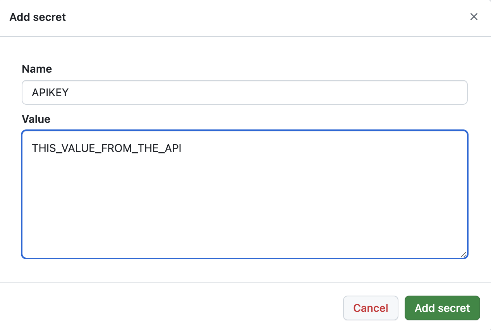
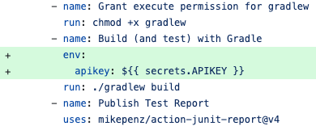

## ApiKey

This library simplifies retrieval of api keys when stored locally and on GitHub.

### Dependency

``` groovy
implementation 'com.andrewoid:apikeys:0.2'
```

### Usage

```java
ApiKey apiKey = new ApiKey();
String keyString = apiKey.get();
```

### Storing API Keys Locally

Make sure your `.gitignore` includes this line

``` gitignore
**/apikey.properties
```

Create a file `src/main/resources/apikey.properties` in your project. This file must **NOT** be checked into git.

```
apikey=ApiKeyGivenToYouByTheApiWhenYouSignUp
```

### Storing API Keys on GitHub

1. Open your Repository on GitHub and go to `Settings`

2. In `Secrets and Variables` add a new Repository Secret called `APIKEY`. The value should be the API key that was
   given to you by the service.



### Accessing API Keys with GitHub Actions

Pass the API key as an environment variable to your build.




